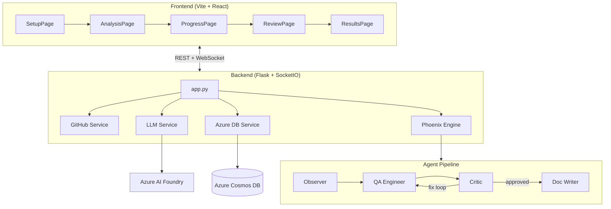

# Phoenix Web Application — Walkthrough

## What Was Built

Transformed the CLI-based Phoenix multi-agent test generation system into a full web application with Azure service integration.

### Architecture



---

## Files Created / Modified

### Backend (6 new, 1 modified)

| File | Purpose |
|------|---------|
| [app.py](file:///home/pprakash/phoenix/app.py) | Flask + SocketIO server with REST endpoints and WebSocket events |
| [services/github_service.py](file:///home/pprakash/phoenix/services/github_service.py) | Clone repos, analyze files, create PRs |
| [services/llm_service.py](file:///home/pprakash/phoenix/services/llm_service.py) | Multi-model Azure AI Foundry client factory |
| [services/azure_db_service.py](file:///home/pprakash/phoenix/services/azure_db_service.py) | Cosmos DB + in-memory fallback store |
| [services/phoenix_engine.py](file:///home/pprakash/phoenix/services/phoenix_engine.py) | Refactored orchestration with WebSocket callbacks |
| [AZURE_SETUP.md](file:///home/pprakash/phoenix/AZURE_SETUP.md) | Step-by-step Azure configuration guide |
| [requirements.txt](file:///home/pprakash/phoenix/requirements.txt) | Updated with 11 new dependencies |

### Frontend (15 new files in `web/`)

| File | Purpose |
|------|---------|
| [SetupPage.jsx](file:///home/pprakash/phoenix/web/src/pages/SetupPage.jsx) | Git URL, LLM select, global context (matches mockup) |
| [AnalysisPage.jsx](file:///home/pprakash/phoenix/web/src/pages/AnalysisPage.jsx) | File cards with per-file context input |
| [ProgressPage.jsx](file:///home/pprakash/phoenix/web/src/pages/ProgressPage.jsx) | Real-time agent pipeline timeline via WebSocket |
| [ReviewPage.jsx](file:///home/pprakash/phoenix/web/src/pages/ReviewPage.jsx) | Test viewer with approve/reject + comments |
| [ResultsPage.jsx](file:///home/pprakash/phoenix/web/src/pages/ResultsPage.jsx) | Downloads, docs viewer, PR creation |
| [Navbar.jsx](file:///home/pprakash/phoenix/web/src/components/Navbar.jsx) | Top navigation bar |
| [StatusBar.jsx](file:///home/pprakash/phoenix/web/src/components/StatusBar.jsx) | Footer with session info |
| [api.js](file:///home/pprakash/phoenix/web/src/services/api.js) | REST API client |
| [useSocket.js](file:///home/pprakash/phoenix/web/src/hooks/useSocket.js) | WebSocket hook for real-time updates |

---

## Setup Page Verification


---

## Build Verification

```
✓ vite build — 87 modules transformed, 0 errors
  dist/index.html        0.75 kB
  dist/assets/index.css  23.42 kB
  dist/assets/index.js   297.72 kB
```

---

## How to Run

```bash
# Terminal 1: Backend
cd /home/pprakash/phoenix
source .venv/bin/activate
pip install -r requirements.txt
python app.py

# Terminal 2: Frontend
cd /home/pprakash/phoenix/web
npm run dev
```

Open **http://localhost:5173** → Setup → enter GitHub URL → analyze → run pipeline → review → approve → download/PR.
